<!-- Banner -->

# Hi, I'm Tejal Dadaji Pagar 👋
### Data Scientist · Data Analyst · Machine Learning Enthusiast

`About` · `Education` · `Experience` · `Skills` · `Projects` · `Stats` · `Connect`

 

## 🧭 About Me

<table>
<tr>
<td width="65%" valign="top">

💡 **Data Scientist** with hands-on experience in **data analysis, machine learning, and predictive modeling**.

📊 Skilled in **Python, SQL, AI/ML, and data visualization** for business-driven insights.

🧠 Strong foundation in **EDA, statistical analysis, and model evaluation**.

🌱 Continuously learning and exploring **advanced ML and automation tools**.

📍 **Location:** Nashik, Maharashtra, India

</td>
<td width="35%" valign="top" align="center">

**Fun Facts**

☕ Analyzes data best with coffee
📈 Loves turning raw data into clear stories
🎯 Passionate about AI, ML & smart automation
📊 Enjoys building clean, aesthetic dashboards

</td>
</tr>
</table>

 

## 🎓 Education

| Degree | Institution | Year |
|---|---|---|
| 🎓 **B.E. Computer Engineering** | Late G. N. College of Engineering, Anjaneri, Nashik | 2023 – 2027 |
| 📘 **HSC** | Karmveer Abasaheb Alias N. M. Sonawane College, Satana | 2023 |
| 📗 **SSC** | Janata Vidyalaya, Utrane, Nashik | 2021 |

 

## 💼 Experience

**Data Science Intern — Bitspark Technologies** &nbsp;`Present`
📍 Nashik, Maharashtra, India
- Selected as a Data Science Intern to work on real-world, data-driven problems
- Strengthening core data science concepts through hands-on, practical learning
- Working with datasets to perform analysis, visualization, and modeling
- Applying theoretical knowledge to meaningful tasks in a professional environment

**Data Science Intern — TechnoHacks Solutions**
📍 Nashik, Maharashtra
- Worked with real-world datasets to derive meaningful insights
- Built machine learning models and visual dashboards
- Performed data analysis using Python and SQL

 

## 🧰 Skills & Tools

<table>
<tr>
<td valign="top" width="50%">

**Languages & Core**
 

**Data Science & ML**
 

</td>
<td valign="top" width="50%">

**Python Libraries**
 

**Automation**
 

</td>
</tr>
</table>

**Focus Areas**
 

 

## 🚀 Projects

<table>
<tr>
<td width="50%" valign="top">

### 📊 Exploratory Data Analysis – Surat City Dataset
Analyzed population trends and extracted key insights; cleaned and visualized data using Python libraries.
 `Python` `Pandas` `Matplotlib` `Seaborn`

</td>
<td width="50%" valign="top">

### 🏠 California Housing Price Predictor
Built an ML model to predict house prices with feature selection and model evaluation.
 `Python` `Pandas` `Scikit-Learn`

</td>
</tr>
<tr>
<td width="50%" valign="top">

### ⚛️ Interactive Atomic Table
Created an interactive atomic model with element details and a responsive UI.
 `HTML` `CSS` `JavaScript`

</td>
<td width="50%" valign="top">

### 🤖 AI Agent Chatbot using n8n
Developed an AI-powered chatbot for automated user responses, integrated with AI model workflows.
 `n8n` `AI Automation`

</td>
</tr>
</table>

 

## 📊 GitHub Activity

  
  

  

 

## 🤝 Let's Connect

