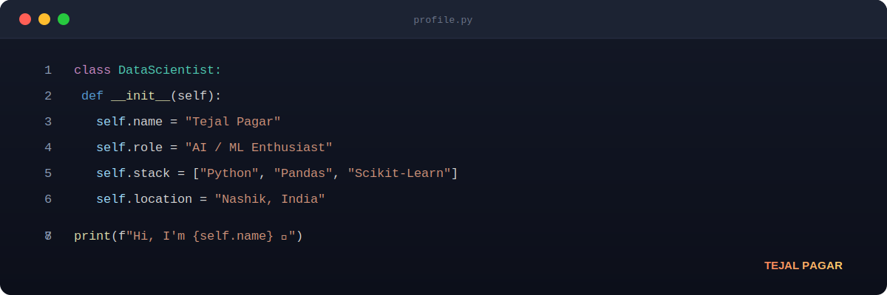

<!-- Banner -->

<h1 align="center">👋 Hi, I'm Tejal Dadaji Pagar</h1>
<h3 align="center">🚀 Data Scientist | Data Analyst | Machine Learning Enthusiast</h3>

  

  

---

## 💼 About Me

💡 **Data Scientist** with hands-on experience in **data analysis, machine learning, and predictive modeling**.

📊 Skilled in **Python, SQL, AI/ML, and data visualization** for business-driven insights.

🧠 Strong foundation in **EDA, statistical analysis, and model evaluation**.

🌱 Continuously learning and exploring **advanced ML and automation tools**.

📍 **Location:** Nashik, Maharashtra, India

📫 **Connect with me:**

* 🔗 [LinkedIn](https://linkedin.com/in/tejal-pagar-636b74343)
* 💻 [GitHub](https://github.com/tejalp68)
* ✉️ [tejalpagar2005@gmail.com](mailto:tejalpagar29@gmail.com)

---

## 🎓 Education

🎓 **B.E. Computer Engineering (2023–2027)**
Late G. N. College of Engineering, Anjaneri, Nashik

📘 **HSC (2023)**
Karmveer Abasaheb Alias N. M. Sonawane College, Satana

📗 **SSC (2021)**
Janata Vidyalaya, Utrane, Nashik

---

## 💼 Experience

### 📌 Data Science Intern — *TechnoHacks Solutions*

📍 Nashik, Maharashtra

* Worked with **real-world datasets** to derive meaningful insights
* Built **machine learning models** and **visual dashboards**
* Performed data analysis using **Python and SQL**

### 📌 Trainee Python Developer Intern — *Bitspark Technologies*
📍 Nashik, Maharashtra, India

* Selected as a Trainee Python Developer Intern to work on real-world, Python-based projects
* Strengthening core Python programming concepts through hands-on, practical learning
* Working with datasets to perform analysis, visualization, and modeling using Python
* Applying theoretical knowledge to meaningful tasks in a professional environment

<!-- ================= SKILLS & TOOLS ================= -->
## 🧰 Skills & Tools

<!-- Row 1: Programming & Core Tools -->

  
  
  
  
  

<!-- Row 2: Python Libraries -->

  
  
  
  
  

<!-- Row 3: Data Science & Machine Learning -->

  
  
  
  

  

## 🚀 Projects

### 📊 Exploratory Data Analysis – Surat City Dataset

* Analyzed population trends and extracted key insights
* Cleaned and visualized data using Python libraries
  **Tech:** Python, Pandas, Matplotlib, Seaborn

### 🏠 California Housing Price Predictor

* Built an ML model to predict house prices
* Performed feature selection and model evaluation
  **Tech:** Python, Pandas, Scikit-Learn

### ⚛️ Interactive Atomic Table

* Created an interactive atomic model with element details
* Designed a responsive UI
  **Tech:** HTML, CSS, JavaScript

### 🤖 AI Agent Chatbot using n8n

* Developed an AI-powered chatbot for automated user responses
* Integrated workflows with AI models
  **Tech:** n8n, AI Automation

---

## 📊 GitHub Stats

  
  

---

## 📅 Commit Calendar

  

---

## 🎨 Fun Facts

☕ I analyze data best with coffee
📈 Love turning raw data into clear stories
🎯 Passionate about **AI, ML, and smart automation**
📊 Enjoy building **clean & aesthetic dashboards**

---

  
  

